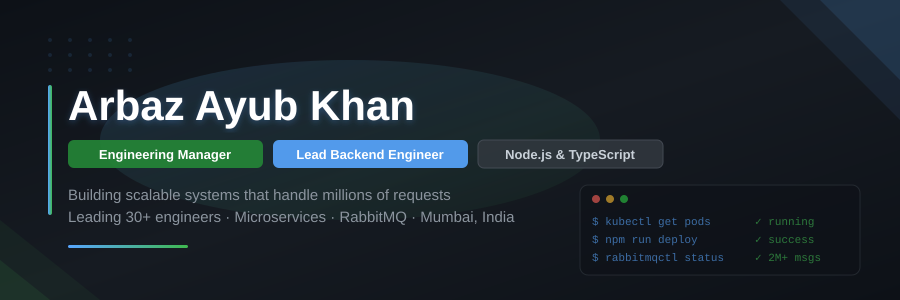

<div align="center">

<!-- CUSTOM HEADER BANNER — commit header-banner.svg to your repo root -->


<br/>

<!-- TYPING ANIMATION -->
<a href="https://github.com/Arbaz-20">

</a>

<br/>

<!-- QUICK LINKS -->
<a href="https://www.linkedin.com/in/arbaz-ayub-khan-a15955190/"></a>&nbsp;
<a href="mailto:arbazkhan37015@gmail.com"></a>&nbsp;
<a href="https://github.com/Arbaz-20"></a>&nbsp;


</div>

---

## 🧑‍💻 About Me

```yaml
name: Arbaz Ayub Khan
location: Mumbai, Maharashtra, India
role: Engineering Manager @ Smartmarine
experience: 4+ years in Backend Engineering & Team Leadership

currently:
  - Leading 30+ developers across maritime SaaS platform services
  - Architecting event-driven microservices processing 2M+ requests/month
  - Driving 99.9% uptime on production RabbitMQ messaging infrastructure

education:
  masters: M.Sc. Computer Science — University of Mumbai (CGPA: 8.88/10)
  bachelors: B.Sc. Computer Science — University of Mumbai (CGPA: 8.23/10)

certification: SAFe 6.0 POPM — Certified Product Owner / Product Manager

fun_fact: "I talk to databases more than I talk to people"
```

---

## ⚡ What I Do

<table>
<tr>
<td width="50%" valign="top">

### 💻 Lead Backend Engineering
Building production-grade **microservices** with Node.js and TypeScript. Designing event-driven systems with **RabbitMQ** that handle millions of requests with 99.9% uptime.

### 👥 Engineering Leadership
Managing **30+ developers** — hiring, mentoring, performance management. Driving **30% productivity gains** through structured code reviews and knowledge sharing.

</td>
<td width="50%" valign="top">

### 🚀 System Design
Architecting **ERP portals**, **CRM platforms**, and **e-commerce backends** with 15+ integrated modules. Designing RBAC, multi-tenant isolation, and audit logging.

### 📋 Agile Delivery
**SAFe 6.0 certified**. Sprint planning, OKR setting, roadmap execution. Reduced time-to-market by **20%** and MTTR by **40%** through incident management frameworks.

</td>
</tr>
</table>

---

## 🛠️ Tech Stack

<div align="center">

### Languages & Runtimes


### Backend & Frameworks


### Messaging & Architecture


### Databases & Caching


### DevOps & Tools


</div>

---

## 📊 GitHub Stats

<div align="center">

<!-- GitHub Trophies — reliable, hosted by ryo-ma -->


<br/><br/>

<!-- GitHub Stats using anuraghazra's PAT-backed instance -->
<picture>
  <source media="(prefers-color-scheme: dark)" srcset="https://github-readme-stats.vercel.app/api?username=Arbaz-20&show_icons=true&theme=github_dark&hide_border=true&bg_color=0d1117&title_color=58a6ff&icon_color=58a6ff&text_color=c9d1d9&count_private=true" />
  
</picture>
&nbsp;&nbsp;
<picture>
  <source media="(prefers-color-scheme: dark)" srcset="https://streak-stats.demolab.com?user=Arbaz-20&theme=github-dark-blue&hide_border=true&background=0d1117&stroke=30363d&ring=58a6ff&fire=58a6ff&currStreakLabel=58a6ff" />
  
</picture>

<br/><br/>

<picture>
  <source media="(prefers-color-scheme: dark)" srcset="https://github-readme-stats.vercel.app/api/top-langs/?username=Arbaz-20&layout=compact&theme=github_dark&hide_border=true&bg_color=0d1117&title_color=58a6ff&text_color=c9d1d9&langs_count=8" />
  
</picture>

</div>

> **💡 Note:** If stats cards show "loading" or appear blank, they'll auto-refresh within a few minutes — this is a known GitHub API rate-limit issue with free-tier widgets.

---

## 🏆 Key Achievements

<div align="center">

| Metric | Impact |
|--------|--------|
| 🚀 **Requests Processed** | 2M+ per month via RabbitMQ infrastructure |
| ⬆️ **System Uptime** | 99.9% under sustained high load |
| 👥 **Team Size** | 30+ developers managed and mentored |
| 📈 **Productivity Gain** | 30% improvement in team velocity |
| ⏱️ **MTTR Reduction** | 40% faster incident resolution |
| 🐛 **Bug Backlog** | 35% reduction through tech debt initiative |
| 🚢 **Time to Market** | 20% faster delivery with SAFe practices |
| 📦 **ERP Modules** | 15+ integrated enterprise modules shipped |

</div>

---

## 🔥 Featured Projects

> **🏢 Enterprise E-Commerce Backend** — NestJS + Sequelize + PostgreSQL + JWT
> 10 ERP-style modules (Auth, Users, Products, Cart, Orders, Payments, Inventory...)
> 79-file production-ready architecture with Swagger docs

> **🚢 ERP Service Portal** — Node.js + TypeScript + PostgreSQL
> 15+ modules: Vessel Management, Procurement, Crew, Voyage Planning, Finance, Compliance
> RBAC, multi-tenant isolation, audit logging — enterprise-grade

> **📊 CRM Portal** — Node.js + Express + RabbitMQ + PostgreSQL
> Lead Management, Sales Pipeline, Contract Lifecycle, Dashboard Analytics
> Event-driven sync with ERP via RabbitMQ

---

## 📈 Contribution Graph

<div align="center">

<picture>
  <source media="(prefers-color-scheme: dark)" srcset="https://github-readme-activity-graph.vercel.app/graph?username=Arbaz-20&bg_color=0d1117&color=58a6ff&line=58a6ff&point=ffffff&area_color=58a6ff&area=true&hide_border=true&custom_title=Arbaz's%20Contribution%20Graph" />
  
</picture>

</div>

> **💡 Tip:** If the graph above appears blank, [deploy your own instance](https://github.com/Ashutosh00710/github-readme-activity-graph) for 100% uptime.

---

## 🤝 Let's Connect

<div align="center">

I'm always open to discussing **backend architecture**, **system design**, **engineering leadership**, or **collaboration opportunities**.

<a href="https://www.linkedin.com/in/arbaz-ayub-khan-a15955190/"></a>&nbsp;
<a href="mailto:arbazkhan37015@gmail.com"></a>

</div>

---

<div align="center">

<sub>⭐ If you find my work useful, consider giving a star!</sub>

</div>